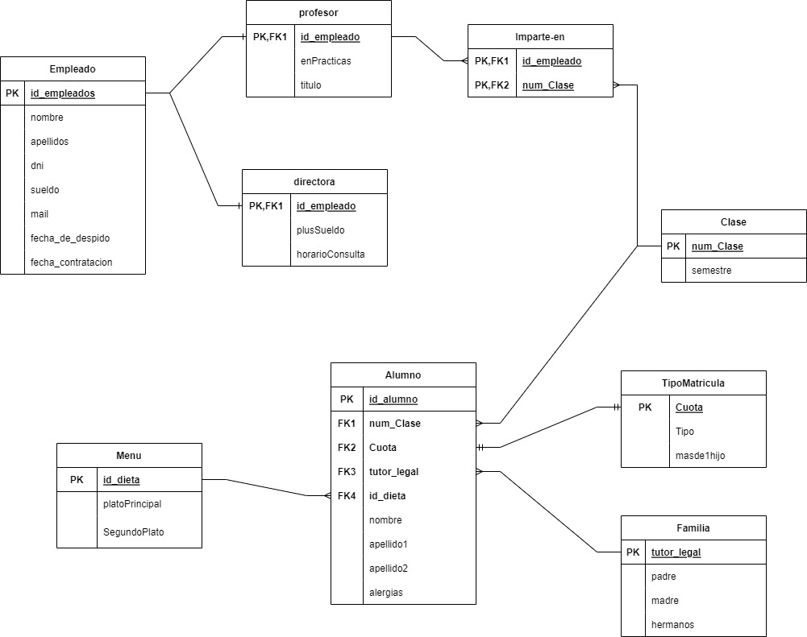
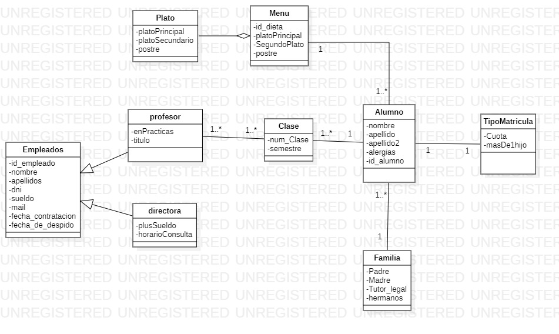

/*ACTUALIZACION 12/06/2023*/
-->Solucionar
-->Arreglar los editars(alumno) y fechas(al editar)
-->arreglar applyDiscount(), no sé como mostrarlo
-->No muestra los tutores legales
-->Se borra la fecha de contratacion y despido al editar

-->BDD Y PROGRAMACION
--->Logica de Negocio-->Varias partes-->
Empleados-->+1 año en la empresa +250e 
Alumnos-->TutorLegal 'Hermano+18'-->-150e de descuento en matricula
-->+1 hermano en la guarderia -->-100e matriculacion

# ProyectoFinalCurso
<h1 align="center">-Entrega proyecto final.</h1>
Usar la carpeta llamada spring, las demas es para tener mi framefork más organizado


Inicio de Sesion
```
Las credenciales de inicio de sesión son las siguientes:
- Usuario: Admin
- Contraseña: admin

- Usuario: user
- Contraseña: 1234
```

-Resumen: 

Bienvenido a CEI PETITS 2, la nueva guarderia de sus sueños para los peques.
Mi guarderia se componen de dos puntos de vista el de usuario y el de administrador, el usuario en este caso tiene acceso a los alumnos y a la misma vista que el usuario no registrado, en este caso el administrado
sería la directora, la cual tiene acceso a las matriculas de los alumnos, las cuotas y las capacidad de dar de alta un nuevo alumno al igual que con los trabajadores, de los cuales podrá ver un historico de sus fechas de contratacion y de sus fechas de despido que no podrá editar por cuestiones de seguridad de la integridad del programa, se trata de una aplicacion web realizada para que cualquiera pueda acceder a ella y visitar la guarderia de manera telemática, para ellos existen las dos vistas dependiendo de la persona que registre.

Tiene una funcion parecida a la web de Salesianos Triana , el diseño no es final, la web está pensada para que siga en desarrollo de ahí que existan varias cosas con funcionalidad nula.
Adentrandonos a un resumen más tecnico de la composicion de la aplicacion web podemos ver las siguientes observaciones previas a la compilación del proyecto
 ```
  -->Primera entrada en la pagina muestra Bienvenido Usuario, cambia dependiendo de la persona que se Logee
  -->Logeo como User muestra Bienvenido user y misma vista que AnonymousUser la diferencia entre Admin y User es que el User solo puede accede al menú.
  -->Logeo como admin, aparece la ventana desplegable donde te da acceso a todas las funcionales de admin.
  -->Al logearse como admin y entrar en el apartado Trabajadores, te permite borrar y editar y crear .
  -->Al realizar el log out sales de la cuenta pero hay que añadir el volver al menú ya que la unica manera de salir del login es dandole
  -->para atrás y al realizar esa acción no es posible salirse.
  -->Todas las webs funcionales y estaticas,no falla ni falta nada de las webs
  -->Buscar del nav no funcional, simplemente estetico, no me dió tiempo a terminarlo
 ```
 >Calendario no funcional, solo estático 
--
<br>
<h2 align="center">Lenguaje de Marcas</h2>
<hr>
El html se encuentra dentro de la ruta spring/ProyectoFinalCurso/src/main/resource, todo lo encontrado dentro de la carpetea resource forma parte de la parte de html, sin tener en cuenta la mezcla con Base de Datos y programacion,las páginas estan compuestas por fragmentos encontrados dentro de la carpeta fragmento que implementamos en los html mas tarde.

JavaScript totalmente funcional, sin librerias, uso de plantillas, uso de Bootstrap,el css y el script es el mismo para todo el proyecto, no se divide, aplicacion web responsive y adaptativa para todos los dispositivos, web animatada, transiciones, preloader..
<br>
<h2 align="center">Programación</h2>
<hr>

Crud completo, editar,borrar y crear, faltan cruds como el de bucar y ordenar, el carrito es funcional pero no funcionan ni el checkout ni el eliminar un objeto por que no me dio tiempo de eliminarlo, por lo demás todo funcional, los editar de trabajadores y alumnos tienen escondidos algunos datos de la entidad como la fechaContratacion de los trabajadores o el id_dieta de los alumnos,las dietas y las fechas estaban preparadas para que las puediera organizar otro usuario que no me dio tiempo a añadir y al intentar incorporarlas para el admin estaba dando muchos problemas de compilacioón por lo que he decidido dejarlo fuera del programa.

Por ultimo, falta el html de gestión de errores pero sus clases están añadidas a falta de crear las rutas de acceso para ellos 
<br>
<h2 align="center">Base de Datos</h2>
<hr>
Esquemas de Entidad-Relacion del proyecto de final de curso.
<div>
  
  
</div>
Esquemas enfocados en optimizar el uso de la guardería, faltan por agregar las entidades del Carrito como lo por ejemplo la de Empresa.
Entidades sin asociaciones ni composicion ya que no he podido solucionar los errores al implementarlo en Spring

<br>
<h2 align="center">Entorno de Redes</h2>
<hr>

Todas la ramas aprovechadas y mergeadas en lo máximo posible, issues completadas, proyecto con las tareas cerradas y cumplidas *casi* en su totalidad ,como ya he repetido tengo pensamiento de continuar desarrollado la aplicacion web y no cerrar el proyecto, por lo demás rama main sin ningun fallo a falta de un gestión de errores explicada en el apartado de programacion
